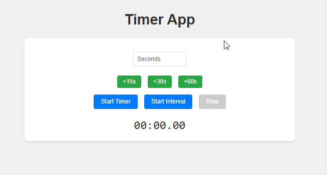

# Timer PWA

A Progressive Web App (PWA) for timing tasks with both one-shot and interval timer functionality. Features a sleek `MM:SS.ss` display, incremental time presets, and an interval counter.

 <!-- Replace with an actual screenshot if you have one -->

## Overview

This Timer PWA allows users to set a timer or an interval timer with a single input field. It displays time in a `MM:SS.ss` format (minutes, seconds, hundredths), vibrates and beeps when the timer hits zero, and includes an interval counter for tracking completed intervals. Preset buttons (`+15s`, `+30s`, `+60s`) make it easy to quickly add common time durations.

The app is installable on mobile and desktop devices, works offline thanks to a service worker, and is hosted on GitHub Pages.

## Features

- **Single Timer**: Set a time and start a one-shot countdown that beeps and vibrates at zero.
- **Interval Timer**: Set a time for a repeating countdown with an interval counter showing how many cycles have completed.
- **Time Display**: Shows time in `MM:SS.ss` format for precise and visually appealing tracking.
- **Preset Buttons**: `+15s`, `+30s`, and `+60s` buttons to incrementally add time to the input field.
- **Feedback**: Beeps and vibrates (on supported devices) when the timer reaches zero.
- **PWA Features**: Installable, works offline, and uses a service worker for caching.
- **Responsive Design**: Works on mobile, tablet, and desktop.

## Demo

Visit the live demo on GitHub Pages:  
[https://wesf90.github.io/timer/](https://wesf90.github.io/timer/)

## Installation

### Running Locally
1. **Clone the Repository**:
   ```bash
   git clone https://github.com/wesf90/timer.git
   cd timer
2. **Serve the Files**: Use a local server (e.g., Python's built-in server): `python -m http.server 8000`

Open http://localhost:8000 in your browser.

### Deploying to GitHub Pages

1.  **Push to GitHub**: Ensure all files are committed and pushed to your repository.
2.  **Enable GitHub Pages**:
    -   Go to <https://github.com/wesf90/timer/settings/pages>.
    -   Set the source to your main branch and root directory (/).
    -   Save, then wait for deployment (takes a few minutes).
3.  **Access**: Visit <https://wesf90.github.io/timer/>.

### Requirements

-   A modern browser (Chrome, Firefox, Safari, Edge) with PWA support.
-   A beep.mp3 file in the root directory for sound feedback (not included; see below).
-   An icon.png (192x192) for the PWA icon (optional, not included).

Usage
-----

1.  **Set Time**:
    -   Enter a number of seconds in the input field manually, or:
    -   Click +15s, +30s, or +60s to add time incrementally (e.g., click +15s twice for 30s).
2.  **Start a Timer**:
    -   Click **Start Timer** for a one-shot countdown.
    -   The display counts down from your set time (e.g., 00:15.00) to 00:00.00, then beeps and vibrates.
3.  **Start an Interval Timer**:
    -   Click **Start Interval** for a repeating countdown.
    -   The display shows the time plus an interval counter (e.g., 00:05.00 (0) → 00:05.00 (1)), incrementing each time it resets.
4.  **Stop**:
    -   Click **Stop** to end the timer and reset the display to 00:00.00.
5.  **Install as PWA**:
    -   On mobile or desktop, click the browser's "Install" or "Add to Home Screen" option to use it as a standalone app.

Files
-----

-   index.html: Main HTML structure.
-   styles.css: Styling for the app.
-   timer.js: Core timer logic and interactivity.
-   service-worker.js: Service worker for offline caching.
-   manifest.json: PWA manifest for installation.
-   beep.mp3: Audio file for timer completion (you must provide this).
-   icon.png: App icon (192x192, optional).

Adding a Beep Sound
-------------------

The app requires a beep.mp3 file for audio feedback:

1.  Download a royalty-free beep sound (e.g., from [Pixabay](https://pixabay.com/sound-effects/) or [ZapSplat](https://www.zapsplat.com/sound-effect-category/beeps/)).
2.  Place it in the root directory of your repo.
3.  Ensure timer.js points to the correct path (new Audio('beep.mp3')).

Contributing
------------

1.  Fork the repository.
2.  Create a new branch (git checkout -b feature-name).
3.  Make your changes and commit (git commit -m "Add feature").
4.  Push to your fork (git push origin feature-name).
5.  Open a Pull Request.

License
-------

This project is licensed under the MIT License.

Credits
-------

Built by Wes Foster (WesFoster.com)
